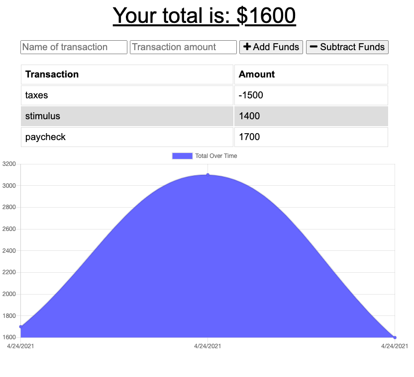

# BudgetTracker

## Description

Budget Tracker is a progressive web application that allows the user to tracker their expenses. They can add or subtract funds from their overall budget and track it all on a chart and table diaplyed on the page. The user can even use the application without a connection to the server and the values will be stored locally and then added to the database when the connection is restored.

Here is a link to my deployed application: https://vast-hollows-89882.herokuapp.com/

## Installation

Run `npm install` to install the required dependencies

## Usage

Use `npm start` to start the server and then either click the link to http://localhost:3000 or enter that URL in your browser.

## Contributing
[Justin Hohing](https://github.com/jhohing)

## Questions
Contact me with any questions: [email](mailto:jnh0627@yahoo.com) , [GitHub](https://github.com/jhohing) 